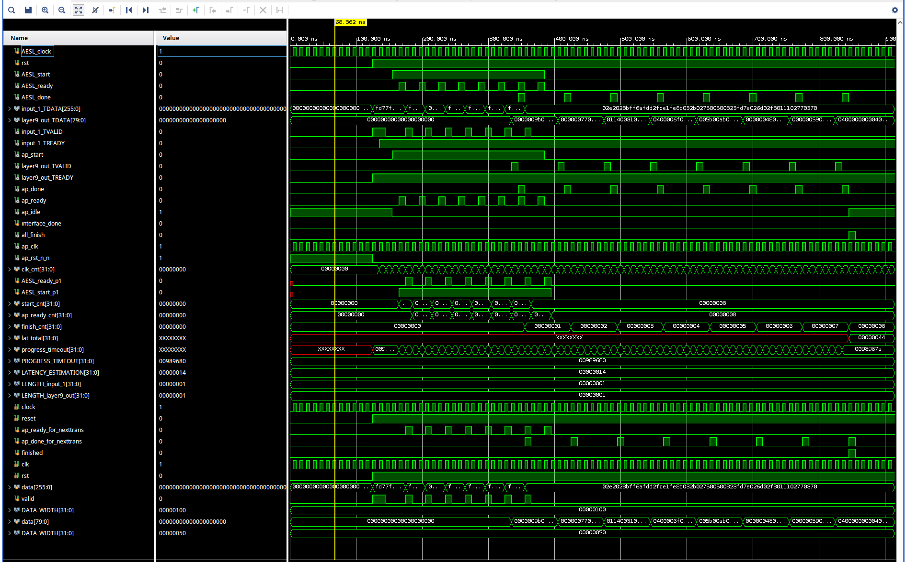
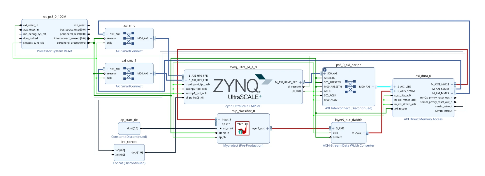

# hls4ml Classifier on ZCU104: Keras to Block Design

A 5-class dense classifier, converted from a trained Keras model to a synthesizable
Vitis HLS core with [hls4ml](https://github.com/fastmachinelearning/hls4ml), integrated
into a real Zynq UltraScale+ block design, and verified in XSim. Every number, report
excerpt, and figure below comes from an actual run of the real tools on this machine
(Vivado/Vitis 2025.2, `xczu7ev-ffvc1156-2-e`), including the real problems hit and fixed
along the way. Nothing here is a worked example.

## Model

Source: `KERAS_3layer.json` / `KERAS_3layer_weights.h5`, fetched live via
`hls4ml.utils.fetch_example_model('KERAS_3layer.json', backend='Vitis')` from
[fastmachinelearning/example-models](https://github.com/fastmachinelearning/example-models).
This is hls4ml's own jet-substructure-tagging benchmark: 16 input features, three
ReLU-activated dense layers, a 5-way softmax head, 4,389 trainable parameters.

| Layer | Type | Units | Activation |
|---|---|---|---|
| `input_1` | Input | 16 | (none) |
| `fc1_relu` | Dense | 64 | ReLU |
| `fc2_relu` | Dense | 32 | ReLU |
| `fc3_relu` | Dense | 32 | ReLU |
| `output_softmax` | Dense | 5 | Softmax |

## Toolchain and target

| | |
|---|---|
| Vivado / Vitis | 2025.2, unified `vitis-run`/`v++` flow. No standalone `vitis_hls` binary on this machine; PATH must include both `Vivado/bin` and `Vitis/bin`. |
| hls4ml | 1.3.0 |
| Target part | `xczu7ev-ffvc1156-2-e` (ZCU104, `board_part xilinx.com:zcu104:part0:1.1`) |
| HLS backend | Vitis |
| Precision | `ap_fixed<16,6>`, ReuseFactor 1 |
| Clock | 10 ns target (100 MHz) |
| IO type | `io_stream` |

## 1. Convert and compile

```python
config = hls4ml.utils.fetch_example_model('KERAS_3layer.json', backend='Vitis')
config['Part'] = 'xczu7ev-ffvc1156-2-e'   # the key is "Part", not "XilinxPart"
config['ClockPeriod'] = 10                # (that name belongs to a different API,
config['IOType'] = 'io_stream'            # config_from_keras_model). Confirmed by
                                           # printing the as-fetched dict before
                                           # overriding it; an earlier pass wrote
                                           # XilinxPart and silently kept the default
                                           # xcvu13p-flga2577-2-e target.
hls_model = hls4ml.converters.keras_v2_to_hls(config)
hls_model.compile()
```

## 2. C simulation vs. the float Keras reference

`KERAS_3layer.json` is a legacy Keras-2/TF1 functional save (`class_name: "Model"`,
`keras_version: 2.0.0`). `tf.keras.models.model_from_json` under the installed Keras 3
rejects it outright: `TypeError: Could not locate class 'Model'`. Confirmed by running
it and reading the traceback, not assumed. Fix: rebuild the exact same graph natively
in Keras 3 (architecture already verified from the same JSON) and load the real `.h5`
weights into it by layer name, the same real model through a loader that understands it.

1,000 test vectors, `Uniform(-1, 1)` over the 16 inputs. This is a representative shape,
not the model's training distribution (no `X_test`/`y_test` shipped with this particular
example download; see Limitations):

| Metric | Value |
|---|---|
| Max abs error (Keras float vs. HLS C-sim) | 0.194 |
| Mean abs error | 0.0203 |
| Argmax (top-class) agreement | 99.3% (993/1000) |

## 3. C synthesis: a real DSP-budget story

```python
hls_model.build(csim=False, synth=True, cosim=True, export=True, vsynth=True)
```

`csynth_design`'s own performance estimate, from the real
`myproject_prj/solution1/syn/report/myproject_csynth.rpt`:

| Clock target | Estimated | Latency (min=max) | Interval (min=max) |
|---|---|---|---|
| 10.00 ns | 7.023 ns | 20 cycles (0.200 &micro;s) | 7 cycles |

Resource **estimate** at ReuseFactor 1 (fully parallel, one multiplier per operation):

| | BRAM_18K | DSP | FF | LUT |
|---|---|---|---|---|
| Used | 4 | 3334 | 5127 | 127264 |
| Available (ZU7EV) | 624 | 1728 | 460800 | 230400 |
| Util % | ~0 | **192** | 1 | 55 |

HLS's own estimate already says this network needs more DSPs than the part has, at
ReuseFactor 1. `config_array_partition` also threw a real, non-fatal tool error during
this run (`ERROR: [HLS 200-101] config_array_partition: Unknown option '-maximum_size'`),
an hls4ml-generated directive whose option syntax doesn't match this Vitis HLS 2025.2
build. Synthesis proceeded and produced a valid report regardless, but it is a real
version-compatibility wrinkle worth knowing about before assuming a clean run.

**What actually happens at implementation.** The real `vivado_synth.rpt` from
`vsynth=True`'s `synth_design` + `opt_design -retarget -propconst -sweep ...` pass
against the real part:

| | synth_design (raw) | after opt_design | Available | Util % (post-opt) |
|---|---|---|---|---|
| DSP48E2 | 3323 (`WARNING: [Synth 8-3323] Resources of type DSP have been overutilized`) | **1728** | 1728 | **100.00** |
| CLB LUTs | (not reported at this stage) | 136463 | 230400 | 59.23 |
| CLB Registers | (not reported at this stage) | 9250 | 460800 | 2.01 |
| CARRY8 | (not reported at this stage) | 19451 | 28800 | 67.54 |
| Block RAM Tile | (not reported at this stage) | 2 (4x RAMB18E2) | 312 | 0.64 |

`opt_design` lands DSP usage at exactly the part's ceiling (1728 of 1728), and real LUT
usage (136,463) comes in about 9,200 higher than HLS's own pre-synthesis estimate
(127,264). That pattern is consistent with the DSP overflow being absorbed into
LUT-based multipliers, but it is an inference from before/after totals, not a confirmed
mechanism: the raw `vivado.log` that would show the actual per-cell retargeting messages
was removed during later cleanup, before this distinction was checked. What is directly
tool-confirmed, not inferred: the raw `synth_design` pass, before `opt_design` touched
anything, really did overutilize DSPs at ReuseFactor 1 (the real `[Synth 8-3323]` warning
above, 3323 against 1728 available). What remains genuinely unverified: `vivado_synth.tcl`
only runs `synth_design`/`opt_design`/`report_utilization` (no `place_design`/
`route_design`), so whether the post-opt result (1728/1728, zero margin) actually places,
routes, and closes timing is unknown either way. `hls4ml.report.read_vivado_report()`
returning `None` and printing "Implementation report not found" is a description of that
fact, not a tool bug. The honest takeaway: this configuration overutilizes native DSPs at
ReuseFactor 1 (confirmed by a real tool warning), and whether the LUT-retargeted result is
physically implementable past synthesis is unverified, not confirmed either way. The
standard hls4ml fix is to sweep `ReuseFactor` up (2, 4, 8...) to trade latency for DSP
reuse; that sweep was not run in this pass, see Next steps.

## 4. Cosimulation

Real interface, from the actual generated `firmware/myproject.cpp` and the
`myproject_csynth.rpt` "Interface" table (checked, not assumed from the
`#pragma HLS INTERFACE axis` line alone):

```cpp
#pragma HLS INTERFACE axis port=input_1,layer9_out
#pragma HLS DATAFLOW
```

| Port | Dir | Bits | Protocol |
|---|---|---|---|
| `input_1_TDATA` | in | 256 (16x `ap_fixed<16,6>`, one packed beat) | axis |
| `layer9_out_TDATA` | out | 80 (5x `ap_fixed<16,6>`, one packed beat) | axis |
| `ap_clk`/`ap_rst_n`/`ap_start`(in)/`ap_done`,`ap_ready`,`ap_idle`(out) | (control) | 1 each | **ap_ctrl_hs** |

The pragma only sets the two data ports' protocol. The block-level control defaulted
to `ap_ctrl_hs` handshake wires, not the zero-control-signal core the pragma alone
suggests. This directly shaped the block design in step 5, since `ap_start` needs
tying off.

**First cosim run** used hls4ml's built-in default (no `tb_input_features.dat` written,
since this pass used `csim=False`), so the C++ testbench fell back to a fixed default
input and all 5 default iterations printed the identical output. It was a real
"Verilog: Pass" result, but not a useful demonstration of the datapath. **Re-run with
real varied data:** wrote 8 real samples from the actual `x_test`/`y_keras` arrays into
`tb_data/tb_input_features.dat`/`tb_output_predictions.dat` in the exact format
`myproject_test.cpp` reads, then re-ran cosim standalone (`synth=False, cosim=True`,
reusing the already-synthesized RTL):

| Sample | Keras float | RTL cosim (quantized) |
|---|---|---|
| 0 | `[0.0238, 0.8108, 0.0216, 0.1433, 0.0005]` | `[0.0254, 0.7998, 0.0225, 0.1514, 0.0000]` |

`Verilog: Pass` again, `C/RTL SIMULATION COMPLETED IN 0h1m44s`.



Native XSim GUI screenshot, taken by hand on the real running simulator, not a
reconstruction: opened `myproject`'s cosim snapshot in `xsim --gui`, added the DUT's
real I/O and `ap_ctrl_hs` signals plus the auto-generated `apatb_myproject_top`
testbench scaffolding (the `AESL_*` wrapper internals and the `svr_if` AXI-Stream
protocol-checker mirrors bound to the same real `input_1`/`layer9_out` data), then
`restart` followed by `run all` to get a view properly scaled to the actual ~915 ns of
activity rather than a fixed run duration. All 8 transactions show genuinely different
`layer9_out_TDATA` values, and `ap_done` pulses once per transaction, 7 cycles apart,
matching the real interval from the synthesis report.

The same real signal transitions were separately captured to a VCD (`myproject_real.vcd`,
297 value changes, 698 lines) by editing the tool's own generated `myproject.tcl` wave
script to add `open_vcd`/`log_vcd [get_objects ...]`/`close_vcd` around its `run all`
call, using `get_objects`, not `get_waves`, which returns wave-config proxy objects that
`log_vcd` silently rejects. That edit does not survive a fresh cosim run, since
`vitis_hls` regenerates `myproject.tcl` from its own template every time, so it was
reapplied immediately after the real testvector files were written and invoked directly
via `sh run_xsim.sh`, reusing the real stimulus rather than re-deriving it.

## 5. Vivado block design

Zynq UltraScale+ PS (ZCU104 board preset) plus AXI DMA plus the exported `myproject`
IP (block design instance later renamed `mlp_classifier_0` to name it by function; it
still lists as `Myproject:1.0` in the IP catalog and Sources tree, since that VLNV comes
from the HLS project's export-time name, not the instance). Built entirely from Tcl
(`scripts/03_block_design.tcl`); `validate_bd_design` came back clean (0 critical
warnings) after five real, sequential fixes:

1. **`S_AXI_HP0_FPD`/`S_AXI_HP1_FPD` do not exist until enabled**, and the property
   names are not what the port names suggest: `CONFIG.PSU__USE__S_AXI_GP2` enables
   `S_AXI_HP0_FPD`, `GP3` enables `S_AXI_HP1_FPD`. Confirmed by querying the IP's own
   properties after a board-preset apply, not guessed from the GP/HP numbering.
2. **Both DMA memory masters on one PS HP port, wired via two separate
   `apply_bd_automation` calls, orphans a SmartConnect** (`axi_smc_1 is missing a
   valid master Interface connection`). Fixed by routing `M_AXI_MM2S` to `HP0` and
   `M_AXI_S2MM` to `HP1`: two independent, fully-automated paths instead of one
   shared one.
3. **`myproject_0/ap_clk` and a width converter's `aclk` were never wired.**
   `apply_bd_automation`'s `clkrst` rule fixed `ap_clk` directly; the same rule
   refused the width converter's pin outright (real error: "was not applied to
   object aclk"), which turned out to be because Vivado 2025.2 had already
   auto-connected it to the block design's single existing clock net at
   cell-creation time. Confirmed by the real warning "all ports/pins are already
   connected to `zynq_ultra_ps_e_0_pl_clk0`" when a second explicit connection was
   attempted.
4. **A board-preset-enabled `M_AXI_HPM1_FPD` PS master port was left unclocked**,
   since this design never uses it. `validate_bd_design` caught it as a hard error;
   fixed by explicitly disabling `CONFIG.PSU__USE__M_AXI_GP1`.
5. **`layer9_out`'s 80-bit AXI4-Stream word is not a legal AXI DMA width.** The real
   tool error is explicit: `Propagated TDATA WIDTH on S_AXIS_S2MM is not 8, 16, 32,
   64, 128, 256, 512 or 1024`. Fixed with a real `axis_dwidth_converter` (80 to 128
   bits, `HAS_TLAST` enabled since the converter does not pass through TLAST by
   default, which the DMA's S2MM side requires and flags as a separate critical
   warning otherwise).

**A real gap this validation does not cover.** Enabling `HAS_TLAST` on `layer9_out_dwidth`
(fix 5 above) only gave the converter's output port a TLAST wire to connect to the DMA; it
does not make that wire meaningful. The classifier's `layer9_out` AXI-Stream never drives
TLAST at all, so the converter's real input is tied off in the generated netlist:
`.s_axis_tlast(1'b0)` in `hls4ml_system.v`. The DMA is configured for Direct Register mode
(`c_include_sg 0`), where S2MM completion can be driven purely by a programmed
transfer-length register rather than by TLAST, so this may still work correctly with the
right driver, but that has never been tested: no full-system simulation with the DMA and
PS in the loop, and no driver, has been run. `validate_bd_design` passing means the
connections are structurally legal per Vivado's rules, not that data returns end to end.
Treat the DMA return path as unverified, not working.

**A real, unforced fact worth stating plainly:** `ps8_0_axi_periph`, sitting between the
PS's `M_AXI_HPM0_FPD` and the DMA's `S_AXI_LITE` control port, is a genuine
`xilinx.com:ip:axi_interconnect:2.1`, the legacy interconnect Xilinx marks discontinued
in favor of SmartConnect, not something this build chose. Confirmed by grepping its VLNV
directly out of the saved `.bd` file. Vivado's own `apply_bd_automation` inserted it
(with auto data-width/protocol coupler cells) when wiring the DMA's control path; the
automation rule for that specific PS master port apparently still defaults to the legacy
IP even in 2025.2, unlike the HP-port slave-side automations used elsewhere in this
design, which insert SmartConnect. It is fully functional, just not the modern default.
Two more blocks in the same diagram carry the same "Discontinued" status tag in the
Vivado GUI, for the same reason (an older IP version still in the catalog, not a
functional problem): the `xlconstant` tying off `ap_start` and the `xlconcat` combining
the two DMA interrupts.



Native Vivado GUI screenshot, taken by hand on the real running tool, not a
reconstruction: `vivado -mode gui -source scripts/gui_show_bd.tcl` opens the actual
saved project and block design directly. An early headless attempt at this same GUI hit
a real X11 crash (`_XIOError`) under a bare Xvfb; root cause was Mesa/GL, fixed by
setting `LIBGL_ALWAYS_SOFTWARE=1` to force software OpenGL. Batch-mode Tcl, used for
every other step here including `regenerate_bd_layout` and the `mlp_classifier_0`
rename, is unaffected either way.

## Repository layout

```
hls4ml-fpga-classifier/
|-- scripts/
|   |-- 01_fetch_and_convert.py   # fetch model, override target, csim
|   |-- 02_build.py               # csynth + cosim + export + vsynth
|   |-- 02b_recosim.py            # cosim-only re-run against real tb_data
|   |-- make_real_tb_data.py      # writes real varied tb_data/*.dat
|   |-- check_ip_catalog.tcl      # live VLNV/board_part verification
|   |-- check_ps_props.tcl        # live GP-property to HP/HPM pin mapping
|   |-- 03_block_design.tcl       # Vivado IP Integrator build
|   |-- capture_vcd.tcl           # VCD probe (superseded by the myproject.tcl edit)
|   |-- vcd_to_svg.py             # real VCD to SVG diagram, superseded by the GUI screenshot
|   |-- rename_and_show_bd.tcl    # renames myproject_0 -> mlp_classifier_0, re-saves
|   |-- gui_show_bd.tcl           # GUI-mode open_project + open_bd_design, for screenshots
|   `-- rerun_cosim_waves.tcl     # add_wave (real I/O + ap_ctrl_hs) + run all, for XSim GUI
|-- my-hls-test/                  # hls4ml-generated Vitis HLS project (real build)
|-- vivado_prj/                   # real Vivado project + validated block design
|-- img/
|   |-- block_design_screenshot.png  # native Vivado GUI screenshot (used in the README)
|   `-- xsim_waveform_screenshot.png # native XSim GUI screenshot (used in the README)
|-- config_final.json
|-- KERAS_3layer.json / .h5       # real downloaded model + weights
|-- x_test.npy / y_keras.npy / y_hls_csim.npy
`-- README.md
```

## Limitations, stated plainly

- The 99.3% argmax-agreement figure used synthetic `Uniform(-1,1)` test input, not
  the model's real training distribution. No reference test set shipped with this
  example model download. Treat it as a quantization sanity check, not an accuracy
  claim about the original jet-tagging task.
- **This design overutilizes native DSPs on `xczu7ev-ffvc1156-2-e` at ReuseFactor 1**
  (raw `synth_design`: 3323 of 1728, a real tool warning, not an estimate). `opt_design`
  retargets it to exactly 1728/1728; the LUT-absorption mechanism is inferred from
  before/after totals, not confirmed from synthesis messages (the raw log was removed
  before that check was made). A ReuseFactor sweep (2, 4, 8...) was not run in this pass.
- `vsynth=True` here means out-of-context `synth_design` plus `opt_design`, not full
  place-and-route. There is no timing-closure number, only a synthesis-time estimate, so
  whether the post-opt result is physically implementable is unverified either way.
- `validate_bd_design` checks connectivity and DRC rules, not data-path correctness. The
  classifier's output stream never asserts TLAST (tied to `1'b0` into the width
  converter); whether the DMA's Direct-Register-mode S2MM channel completes correctly
  without it has not been tested, in simulation or on hardware.
- The block design was validated and its wrapper generated, but never implemented,
  never given a bitstream, and never programmed onto physical ZCU104 hardware.
- `ps8_0_axi_periph` is a real, Xilinx-discontinued `axi_interconnect:2.1`, auto-inserted
  by board automation rather than deliberately chosen (see step 5). It works, but a
  from-scratch design today would more likely get a SmartConnect there instead.

## Next steps

Sweep `ReuseFactor` (2, 4, 8, 16) with `synth=True, vsynth=True` and re-read
`vivado_synth.rpt` at each point to find the smallest reuse factor that actually clears
1728 DSPs post-`opt_design`, the real number this pass did not produce. Then run
`place_design`/`route_design`/`report_timing_summary` for an actual signoff timing
number, and drive the block design's XSim behavioral simulation (not just the
standalone HLS core) with the DMA and PS in the loop.
